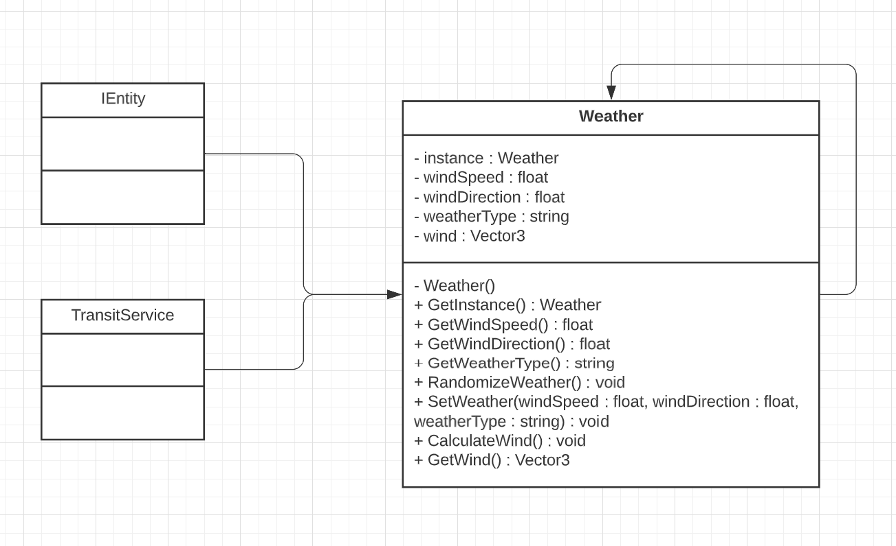
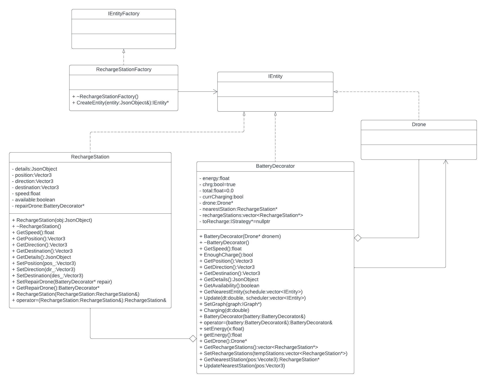

# Delivery Drone Simulation
Vincent Liu, Tyler Pham, Preston Zhu, Rodrigo Alanis

**Docker Link**

https://hub.docker.com/repository/docker/liu01841/homework4-projectextension/general

This link will redirect to dockerhub where a Docker image can downloaded of our project. This allows us to easily create, distribute, and run our project in different environments.

**YouTube Link**

https://youtu.be/OmFVWsDA4QA

This link will redirect to the group presentation on YouTube. The presentation slides will be available in the repo under the name, 3081W ProjectPresentation.pdf. 

**What is the project about (overview of the whole project, not just the hw4)?**

The project is a Drone Simulation System where a robot(the passenger) is picked up from a user-set origin and dropped off at a user-set destination. The robot has its own behavior based on the user-selected navigation strategy. A drone will have a set amount of energy that must be periodically replenished. We calculated its final speed using its initial speed and the wind direction. A 3D visualization of the pick-up-drop-off is provided so the user can keep track of the progress of the route. The project is a web-based application so the user can provide instructions for the simulation through a local web page. 

**How to run the simulation (overview of the whole project, not just the hw4)?**

In a bash environment, 

Go to the project directory
cd /path/to/repo/project

Build the project

make -j

Run the project (./build/web-app <port> <web folder>)

./build/bin/transit_service 8081 apps/transit_service/web/

Navigate to http://127.0.0.1:8081 and you should see a visualization.
Navigate to http://127.0.0.1:8081/schedule.html and you should see a page to schedule the trips.

Note: 8081 will depend on what port you used. If you use port 8082, then it will be http://127.0.0.1:8082 instead.

**What does the simulation do specifically (individual features i.e. movement of entities etc) (overview of the whole project, not just the hw4)?**
  
There are many features for this simulation. Based on user input through the schedule page, a drone flies to a specified location to pick up the robot. The drone then takes the robot to its destination. The user-selected navigation strategy will dictate its movements and celebrations during the travel request. The project also features a recharge station system where the drone is assigned a battery that depletes as the drone completes a trip. The drone will automatically determine whether or not it has enough energy to complete a travel request. If the drone cannot complete the travel request with sufficient power, it will go to the nearest recharge station to recharge its energy. Another feature is weather, which factors in the effects of wind on the drone’s behavior. Wind direction and wind speed determine whether or not its speed will increase or decrease. These features provide another dimension to the simulation to make it more realistic and engaging.

# Random Weather
**What does it do?**

Random weather creates winds of varying speeds and directions in 360 degrees that affect the movement of the entities in the simulation. We separated the weather conditions into four different classes: sunny in which winds are low or from 0 to 10, breezy where winds are mild in 10 to 25, high winds where some entities such as a drone are heavily affected but a helicopter may still be able to move with winds of 25 to 55, and tornadoes in which all entities are unable to move since winds are above 100. There is a 30% chance of each weather type and a 10% of a tornado happening. The weather refreshes every 10 seconds in the simulation. 
In our simulation, if entities move against the wind, their speeds are slowed and may even be reduced to 0 if the wind speed is high enough. However, if entities move in the direction of the wind, the winds increase the speed of the entities and cause the entities to move faster. 

**Why is it significantly interesting?**
  
In real life, weather affects drones and helicopter movement. This feature makes the simulation more realistic, albeit with higher extreme weather chances. Rather than the drones and helicopters moving at fixed speeds, wind makes the simulation more varied and changes the movement speeds of the entities. Therefore, adding this feature creates a more interesting experience as each trip features more variation and realistic qualities. 

**How does it add to the existing work?**
  
The current simulation models a drone delivery system in ideal weather conditions (no wind). By creating a weather system, we added to the existing work by making it more realistic and detailed for future runs. 

**Which design pattern did you choose to implement it and why?**
  
We implemented weather using the singleton pattern, meaning only one instance of the weather singleton will exist during the simulation. The weather should be universal throughout the simulation since it only encompasses the University’s campus. Therefore all entities should reference the same object when determining the effects of weather. All entities can use a public GetInstance() method to access the existing weather instance. If there is not an existing weather instance, the function will call the private constructor to create a weather instance. 

**Instruction to use this new feature (if the new feature is not user interactable, please mention this as well)**
  
Weather is not user interactable. The varying wind speeds are random with sunny having a 30% chance, breezy having a 30% chance, high winds with a 30% chance, and tornadoes having a 10% chance of occurring. The user can view the current type of weather in the top right of the menu screen under the simulation speed slider. No interaction is needed for this feature to run in the simulation. 

# Battery/Recharge Station
**What does it do?**

The battery and recharge station system feature adds a battery to the drone, making the simulation calculate whether it can complete the whole trip with sufficient remaining energy afterward. A drone with sufficient remaining power can travel to the nearest recharge station after a trip to recharge as needed. If it calculates it cannot make the whole trip with sufficient remaining energy, it will travel to the nearest recharge station to replenish its power. After recharging, it will move from its current position to complete the scheduled trip. The battery will deplete as it attempts to complete the travel request. There are three recharge stations spread out in the simulation. The station provides a location for the drones to charge. Drones will recharge at a steady rate until fully replenished. Each station also has a repair drone. If a drone runs out of energy mid-trip due to the weather conditions decreasing its speed, a repair drone from the nearest recharge station will be dispatched to the dead drone's location to replenish its energy. The repair drones will not run out of power mid-trip due to weather conditions because they serve to illustrate a possible solution to this logic problem.

**Why is it significantly interesting?**
  
The battery and recharge system is interesting because it would help us model the drone system with an added energy constraint. When a drone cannot complete a trip with sufficient remaining energy, it will first travel to the recharge station to charge. Then, it would continue with its travel request, calculating whether it can complete its next scheduled trip before attempting the travel request. As mentioned earlier, the weather conditions interaction could fully deplete a drone's energy mid-trip. A possible solution to this problem is to have repair drones at each recharge station that will travel to the dead drone and replenish its power supply. The repair drones will not run out of energy mid-trip. From a business perspective, we could implement these repair drones with solar charging, so their energy recharges during the trip. These solar recharge drones may be more expensive than the non-solar delivery drones, so it could be too costly to have all delivery drones be solar recharge drones. The solar repair drone solution factors in possible monetary cost constraints on the energy system. 

**How does it add to the existing work?**
  
The existing work only accounts for traveling to a robot and delivering that robot. But with the battery and recharge station system, each drone has to factor in the energy costs of a trip. If it cannot complete a travel request with sufficient remaining energy, it has to find the nearest station and recharge before attempting the scheduled trip. Accounting for the possibility of a drone failing to complete a travel request due to weather conditions, a repair drone was added as a possible solution. If the entity's energy fully depletes mid-trip, a repair drone will travel to the dead drone and replenish its energy.

**Which design pattern did you choose to implement it and why?**
  
We chose the decorator design pattern for our battery. The decorator pattern allows us to add new functionality to our existing drone class without altering the original functionality. The battery decorator is a wrapper class that attaches to a drone entity. The battery decorator overrides the update function to add the battery, recharge station, and energy logic to the entity without modifying the entity's original update function. The recharge stations were implemented into our simulation using a factory pattern. The factory pattern allows us to create similar entities while reducing redundant code. 

**Instruction to use this new feature (if the new feature is not user interactable, please mention this as well)**
  
The battery and recharge station are not user interactable. The user will schedule a trip, and the simulation will automatically model the battery and recharge station system. If a drone calculates it cannot complete a travel request with sufficient remaining energy, it will stop by a recharge station before attempting a scheduled trip. The battery depletes at a constant rate as it attempts a trip. When at a recharge station, its energy will also recharge at a constant rate. The repair drones will also automatically travel to and fix dead drones. The user will not have to interact with anything to enable the battery and recharge station system.

# Sprint retrospective

How the sprint went:

We all completed our tasks on time and within each two-week sprint. Nothing went past the outlined deadlines in Jira, but we lacked a risk analysis phase which caused some extra work before turn in. 

Vincent Liu and Preston Zhu created the weather .cc/.h files and implemented the weather logic for the drone and helicopter classes. They added the random weather feature, updating the weather conditions every ten seconds. They also modified the transit_service.cc and the main.js files to display the current weather in the menu box when running the model. Vincent and Preston completed the weather feature within the deadlines set at the start of the project. 

Rodrigo Alanis and Tyler Pham created all files needed to implement the battery and recharge station. They added some functionality to the path strategies to keep track of the total distance of each strategy. Rodrigo and Tyler modified the simulation model, drone factory, and drone files to integrate the battery and stations. Tyler implemented the repair drones at each recharge station and the logic for replenishing dead drones. These were also all done within the deadlines set by the group. 

Finishing assigned work and adhering to deadlines were two strong points in our group project. Our group had clear communication, updating each other with progress and issues. 

Problems:

We encountered an issue with our project after the 1st week when we realized that our lack of risk analysis resulted in an unexpected logic problem while integrating the two features. Our weather feature interfered with the battery energy and recharge station logic. Certain edge cases of weather conditions, such as multiple tornadoes occurring in a row, caused our drones to run out of energy during a trip. We solved this issue by having a group meeting to discuss possible solutions for this logic problem and allocate new tasks. To solve this logic problem, we decided to repair drones that only leave stations to refuel dead drones. 

Future changes:

The most impactful change we can perform for a future sprint can be implementing a risk analysis phase within our project. We encountered an issue integrating the two features that needed a group meeting. A risk analysis phase at the start of the sprint to identify possible problematic edge cases when the two features interact would have prevented the issue.

# Weather Singleton UML:

# RechargeStation Factory and BatteryDecorator UML:

